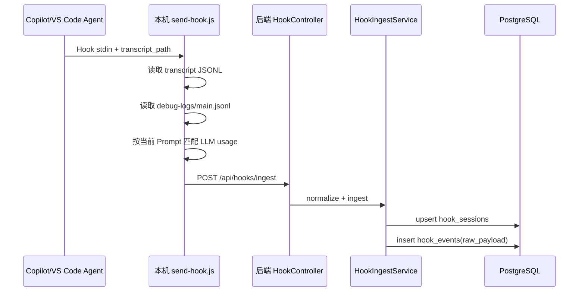
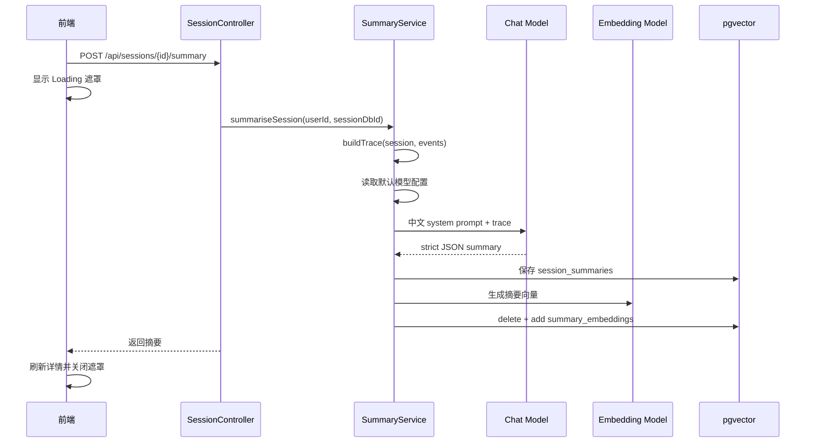

# copilot-hooks-web 项目功能说明与二开维护指南

> 本文档面向后续维护者和 AI 二开助手，用于快速理解项目目标、架构、关键流程、数据模型、扩展点和修改规范。新增或修改功能时，应同步更新本文档中对应章节。

## 1. 项目定位

`copilot-hooks-web` 是一个用于接收、存储、分析和检索 Copilot/VS Code Agent Hook 事件的 Web 服务。

核心目标：

- 接收本机或远端 Hook 事件。
- 保存完整会话、事件、原始 JSON、工具调用、模型调用和 Token/AIC 等用量信息。
- 在前端以会话、对话轮次、Trace、详情三栏形式展示调用链。
- 调用大模型为会话生成中文摘要、标签和关键点。
- 调用向量模型将摘要写入 PostgreSQL/pgvector。
- 通过 REST 和 MCP 暴露个人隔离的查询能力。
- 支持多用户、个人 Token、管理员用户管理和模型配置。
- 支持面向内容整理与排障的对话工作台，可选择模型配置和 MCP 工具。

## 2. 技术栈

### 后端

- Java 21
- Spring Boot 3.4.1
- Spring Security
- Spring Data JPA
- Flyway
- PostgreSQL + pgvector
- Spring AI 1.0.0
  - OpenAI 兼容 Chat Model
  - OpenAI 兼容 Embedding Model
  - PgVectorStore
  - MCP Server WebMVC/SSE

### 前端

- Vite
- React
- TypeScript
- lucide-react
- 自定义 CSS：`frontend/src/styles/brand.css`、`frontend/src/styles/global.css`

### 部署

- `Dockerfile`
- `docker-compose.yml`
- 前端构建产物可由 Spring Boot 静态资源服务，也支持通过挂载目录快速替换。

## 3. 目录结构

```text
copilot-hooks-web/
├── .github/
│   ├── copilot-instructions.md        # AI 二开全局指令
│   └── hooks/                         # 本仓库 Hook 转发配置和脚本
├── docs/
│   └── PROJECT_FUNCTIONAL_SPEC.md     # 本说明文档
├── examples/                          # 示例 Hook 配置
├── frontend/                          # React/Vite 前端
│   └── src/
│       ├── api/                       # HTTP API 封装
│       ├── components/                # 通用组件和布局
│       ├── config/                    # 导航配置
│       ├── pages/                     # 页面
│       ├── styles/                    # 全局和品牌样式
│       ├── types/                     # 前端领域类型
│       └── utils/                     # 格式化工具
├── src/main/java/com/copilot/hooks/
│   ├── config/                        # Security/Web/Password 配置
│   ├── controller/                    # REST 控制器
│   ├── domain/                        # JPA 实体
│   ├── mcp/                           # MCP 工具和配置
│   ├── repository/                    # Spring Data JPA Repository
│   ├── security/                      # Token、Principal、认证过滤器
│   └── service/                       # Hook 入库、摘要和向量服务
├── src/main/resources/
│   ├── application.yml                # 应用配置
│   └── db/migration/                  # Flyway 数据库迁移
├── Dockerfile
├── docker-compose.yml
├── pom.xml
└── README.md
```

## 4. 核心功能模块

### 4.1 Hook 事件接收

入口：

- `POST /api/hooks/ingest`
- `GET /api/hooks/ping`

主要代码：

- `HookController`
- `HookIngestService`
- `.github/hooks/send-hook.js`
- `.github/hooks/1.json`

能力：

- 支持单个 JSON、JSON 数组、NDJSON。
- 支持 Bearer Token 鉴权。
- 识别多种 Hook 字段命名风格。
- 保存原始 payload 到 `hook_events.raw_payload`。
- 输出接收日志，便于排查 Hook 字段缺失或映射异常。

重要约定：

- 远端服务无法直接读取用户机器上的 `transcript_path` 或 Copilot debug log。
- 因此本机 `.github/hooks/send-hook.js` 负责读取 stdin、transcript、debug log 后再转发到后端。
- Token、缓存 Token、AIC、TTFT、模型名等多数用量信息来自本机 `debug-logs/<session>/main.jsonl` 的 `llm_request` 记录。
- 不能简单取“最近一条 LLM 记录”，必须按当前用户 Prompt 匹配用户消息窗口，避免把上一轮对话的 Token 显示到当前轮。

### 4.2 会话与事件存储

主要实体：

- `HookSession`
- `HookEvent`

主要表：

- `hook_sessions`
- `hook_events`

`hook_sessions` 保存会话聚合信息：

- 用户 ID
- 原始 sessionId
- 工作目录
- 开始/结束时间
- 事件数量
- Prompt 数量
- 工具数量
- 错误数量
- 输入/输出/缓存/总 Token
- Copilot AIC 用量

`hook_events` 保存单个事件：

- eventType
- eventTime
- createdAt
- toolName/toolArgs/toolResult
- prompt/errorMessage
- model
- durationMs/ttftMs
- inputTokens/outputTokens/cachedTokens/totalTokens
- copilotUsageNanoAiu
- rawPayload JSONB

维护注意：

- 新增可观测字段时，应同时检查：
  - `HookEvent`
  - `HookSession`
  - `HookIngestService.applyEventDetails(...)`
  - Flyway migration
  - `SessionController.eventView(...)`
  - `frontend/src/types/domain.ts`
  - `frontend/src/pages/SessionDetailPage.tsx`

### 4.3 会话详情展示

主要页面：

- `frontend/src/pages/SessionDetailPage.tsx`

当前交互结构：

- 左侧：按用户交互轮次展示对话列表。
- 中间：语义 Trace，不再按原始事件平铺，而是抽象为：
  - `user`
  - `llm`
  - `tool`
  - `subagent`
  - `hook`
- 右侧：选中 Trace 节点的详情。
- 会话详情默认仅加载最近 7 天事件，可切换“显示全部事件”查看完整历史。

Token 展示原则：

- 优先使用 LLM 语义节点中的 `model_usage_events`。
- 展示输入 Token、输出 Token、缓存 Token、总 Token、TTFT、耗时、AIC/费用信息。
- 不展示 Transcript 原文作为主要信息，Transcript 仅作为补全来源或 raw payload 内部追踪信息。

### 4.4 摘要与向量写入

主要代码：

- `SummaryService`
- `SessionController.POST /api/sessions/{id}/summary`
- `frontend/src/pages/SessionDetailPage.tsx`

行为：

- 会话结束后可自动生成摘要，受 `app.summary.auto-on-session-end` 控制。
- 前端可点击“重新生成摘要并写入向量”。
- 点击后前端显示遮罩 Loading，避免用户不知道是否正在调用。
- 摘要系统提示词使用中文，要求模型返回严格 JSON：
  - `title`
  - `summary`
  - `highlights`
  - `tags`

模型选择：

- 优先使用模型配置页面中启用且设为默认的配置。
- 如果默认配置不存在或不完整，则回退到 `application.yml` 中的 `spring.ai.openai.*` 配置。

向量写入：

- 使用 `summary_embeddings` 表。
- 表主键 `id` 是 UUID。
- `SummaryService` 使用 `UUID.nameUUIDFromBytes("session-summary:" + sessionDbId)` 生成稳定文档 ID。
- 同一个 session 重新生成摘要时会删除并覆盖同一个向量文档，避免重复插入。

维护注意：

- 如果修改 embedding 维度，必须同时保证：
  - 模型配置中的 `embeddingDimensions`
  - `AI_EMBED_DIMENSIONS`
  - `summary_embeddings.embedding vector(<dimensions>)`
- 已存在表不能仅改配置，需要迁移或重建向量列。

### 4.5 模型配置

主要代码：

- `ModelConfig`
- `ModelConfigRepository`
- `ModelConfigController`
- `frontend/src/pages/ModelConfigPage.tsx`

接口：

- `GET /api/admin/model-configs`
- `POST /api/admin/model-configs`
- `PUT /api/admin/model-configs/{id}`
- `POST /api/admin/model-configs/{id}/enable`
- `POST /api/admin/model-configs/{id}/disable`
- `POST /api/admin/model-configs/{id}/default`
- `DELETE /api/admin/model-configs/{id}`

配置项：

- 名称
- Base URL
- API Key
- Chat Model ID
- Embedding Model ID
- Embedding Dimensions
- 是否启用
- 是否默认

维护注意：

- 用户期望“模型配置页面”的默认模型优先生效。
- 新增 AI 调用场景时，应优先读取默认模型配置；仅在没有默认配置或默认配置不完整时回退 `application.yml`。

### 4.6 对话工作台

主要代码：

- `ChatController`
- `ChatWorkspaceService`
- `frontend/src/pages/ChatWorkbenchPage.tsx`

能力：

- 新增菜单“对话工作台”。
- 用户可以选择当前启用的模型配置，也可以回退到 `application.yml` 默认模型。
- 支持调节：
  - `temperature`
  - `topP`
  - `maxTokens`
- 支持自定义 `system prompt`。
- 默认启用全部 MCP 工具，也可以手动勾选部分工具名。
- 返回助手文本、模型名、工具调用列表、基础 token usage。

实现约定：

- `GET /api/chat/options` 返回：
  - 启用模型列表
  - 默认模型 ID
  - 可用 MCP 工具列表
  - 回退模型名
  - 默认 system prompt
- `POST /api/chat/completions` 执行实际对话。
- 后端使用 `ChatClient.toolCallbacks(...)` + `toolNames(...)` 将 MCP 工具接入模型调用。
- 当 `useAllMcp=true` 时挂载全部工具；否则只挂载用户勾选的工具。

### 4.7 用户、Token 与权限

主要代码：

- `SecurityConfig`
- `BearerTokenAuthFilter`
- `TokenService`
- `CurrentUser`
- `AppPrincipal`
- `DbUserDetailsService`
- `AdminController`
- `TokenController`
- `MeController`

能力：

- Basic 登录 Web 控制台。
- Bearer Token 调用 Hook、REST 和 MCP。
- 用户可创建自己的 Token。
- 用户可在个人信息页面更新显示名、邮箱和密码。
- 管理员可管理用户并为用户签发 Token。
- 管理员可通过 Excel 批量导入用户。
- Token 可设置过期时间，也可以永不过期。
- Token 明文仅创建时返回一次，数据库保存哈希。

Excel 导入：

- 接口：`POST /api/admin/users/import`
- 模板下载：`GET /api/admin/users/import/template`
- 仅管理员可用。
- 当前支持读取第一张 Sheet。
- 表头支持中英文字段别名：
  - `username / 用户名 / 账号`
  - `displayName / 显示名 / 姓名 / 名称`
  - `email / 邮箱`
  - `password / 密码 / 初始密码`
  - `role / 角色`
  - `enabled / 启用 / 状态`
- `username` 和 `password` 为必填。
- 已存在用户名会被跳过。
- 前端采用轻量弹框入口：点击“批量导入”后，可下载模板、选择文件并确认导入；导入过程中显示遮罩 Loading。

权限原则：

- 普通用户只能查询自己的 sessions、events、summaries。
- 管理员可以查看和管理所有用户数据。
- MCP 查询必须基于 Bearer Token 隔离用户数据。

### 4.8 搜索与 MCP

REST 搜索：

- `GET /api/search`

MCP SSE：

- `/mcp/sse`
- `/mcp/message`

主要代码：

- `SearchController`
- `HookMcpTools`
- `McpConfig`

MCP 工具：

- `search_sessions`
- `list_recent_sessions`
- `get_session`

MCP 与对话工作台联动：

- 对话工作台并不通过 MCP SSE 回调自身，而是直接复用后端同一组 ToolCallback。
- 这样前端对话和外部 MCP 客户端使用的是同一套真实工具实现，避免出现“菜单能选 MCP、实际只是装饰”的问题。

权限：

- MCP 使用 Bearer Token。
- 查询结果只能包含当前 Token 所属用户的数据。

维护注意：

- 如果摘要向量写入逻辑改为动态模型配置，搜索侧也要评估是否需要同步使用默认模型配置生成查询向量。
- 新增 MCP 工具时要明确入参、返回结构和用户隔离策略。

### 4.9 前端页面

主要页面：

- `DashboardPage.tsx`：概览。
- `SessionsPage.tsx`：会话列表。
- `SessionDetailPage.tsx`：会话详情、Trace、摘要重生成。
- `HookEventsPage.tsx`：Hook 事件追踪。
- `SummariesPage.tsx`：摘要列表。
- `SearchPage.tsx`：语义检索。
- `TokensPage.tsx`：个人 Token。
- `UsersPage.tsx`：管理员用户管理。
- `ModelConfigPage.tsx`：模型配置。
- `ChatWorkbenchPage.tsx`：对话工作台、模型参数、MCP 工具选择。
- `DocsPage.tsx`：接入说明。
- `RoleMenuPage.tsx`：角色菜单。
- `LoginPage.tsx`：登录。

前端约定：

- API 封装在 `frontend/src/api/http.ts`。
- 类型定义在 `frontend/src/types/domain.ts`。
- 导航配置在 `frontend/src/config/navigation.ts`。
- 主样式在 `frontend/src/styles/brand.css`。
- 新增后端字段时，应同步更新前端类型和展示页面。

## 5. 关键数据流

### 5.1 Hook 入库链路



### 5.2 摘要与向量链路



## 6. REST API 总览

| 模块 | 方法与路径 | 说明 |
| --- | --- | --- |
| Health | `GET /api/health` | 健康检查 |
| 当前用户 | `GET /api/me` | 获取当前登录用户和角色 |
| 当前用户 | `PUT /api/me` | 更新当前用户显示名/邮箱/密码 |
| Hook | `POST /api/hooks/ingest` | 接收 Hook 事件 |
| Hook | `GET /api/hooks/ping` | Hook 连通性检查 |
| Sessions | `GET /api/sessions` | 会话列表（支持 `month/day/userId` 筛选） |
| Sessions | `GET /api/sessions/{id}` | 会话详情（默认最近 7 天，`all=true` 查全部） |
| Sessions | `POST /api/sessions/{id}/summary` | 重新生成摘要并写入向量 |
| Search | `GET /api/search` | 搜索摘要/会话 |
| Tokens | `GET /api/tokens` | 当前用户 Token 列表 |
| Tokens | `POST /api/tokens` | 创建当前用户 Token |
| Tokens | `DELETE /api/tokens/{id}` | 吊销 Token |
| Admin Users | `GET /api/admin/users` | 用户列表 |
| Admin Users | `POST /api/admin/users` | 创建用户 |
| Admin Users | `POST /api/admin/users/import` | Excel 批量导入用户 |
| Admin Users | `DELETE /api/admin/users/{id}` | 删除用户 |
| Admin Users | `POST /api/admin/users/{id}/disable` | 禁用用户 |
| Admin Users | `POST /api/admin/users/{id}/enable` | 启用用户 |
| Admin Tokens | `POST /api/admin/users/{id}/tokens` | 管理员为用户创建 Token |
| Model Config | `GET /api/admin/model-configs` | 模型配置列表 |
| Model Config | `POST /api/admin/model-configs` | 创建模型配置 |
| Model Config | `PUT /api/admin/model-configs/{id}` | 更新模型配置 |
| Model Config | `POST /api/admin/model-configs/{id}/enable` | 启用模型配置 |
| Model Config | `POST /api/admin/model-configs/{id}/disable` | 禁用模型配置 |
| Model Config | `POST /api/admin/model-configs/{id}/default` | 设为默认配置 |
| Model Config | `DELETE /api/admin/model-configs/{id}` | 删除模型配置 |
| Chat | `GET /api/chat/options` | 获取对话工作台模型和 MCP 配置 |
| Chat | `POST /api/chat/completions` | 发起对话并可调用选定 MCP 工具 |

## 7. 数据库与迁移

迁移文件：

- `V1__init.sql`：初始用户、Token、会话、事件、摘要、向量表。
- `V2__model_configs.sql`：模型配置表。
- `V3__usage_metrics.sql`：缓存 Token、TTFT、Copilot AIC 等用量字段。

数据库原则：

- 禁止依赖 Hibernate 自动改表，`ddl-auto` 为 `validate`。
- 所有表结构变更必须新增 Flyway migration。
- JSON 原始事件保存在 `hook_events.raw_payload`，用于追踪问题和兼容未来字段。
- 向量表由迁移手动创建，Spring AI `initialize-schema=false`。

## 8. 配置项

主要配置文件：

- `src/main/resources/application.yml`
- `.env.example`
- `docker-compose.yml`

常用环境变量：

| 变量 | 说明 |
| --- | --- |
| `SERVER_PORT` | 服务端口 |
| `DATABASE_JDBC_URL` | PostgreSQL JDBC URL |
| `DATABASE_USERNAME` | 数据库用户名 |
| `DATABASE_PASSWORD` | 数据库密码 |
| `AI_BASE_URL` | OpenAI 兼容 API 地址 |
| `AI_API_KEY` | API Key |
| `AI_CHAT_MODEL` | application.yml 回退聊天模型 |
| `AI_EMBED_MODEL` | application.yml 回退向量模型 |
| `AI_EMBED_DIMENSIONS` | 向量维度 |
| `ADMIN_USERNAME` | 初始管理员用户名 |
| `ADMIN_PASSWORD` | 初始管理员密码 |
| `SUMMARY_AUTO` | 会话结束是否自动摘要 |
| `FRONTEND_PATH` | 静态前端路径 |
| `LOG_LEVEL` | `com.copilot.hooks` 日志级别 |

## 9. 开发与验证命令

后端编译：

```bash
mvn -DskipTests compile
```

前端构建：

```bash
cd frontend
npm run build
```

Docker 启动：

```bash
docker compose up -d --build
```

Hook 转发脚本语法检查：

```bash
node --check .github/hooks/send-hook.js
```

## 10. 新增功能维护清单

每次新增或修改功能时，至少检查：

- 后端：
  - Controller 是否需要新接口。
  - Service 是否保持用户隔离。
  - Entity/Repository 是否需要调整。
  - 是否需要 Flyway migration。
  - 是否需要日志辅助排查。
  - 是否需要更新 MCP 工具。
- 前端：
  - API 封装是否更新。
  - TypeScript 类型是否更新。
  - 页面是否有 Loading、错误提示和空状态。
  - 管理员/普通用户菜单权限是否正确。
  - 刷新页面时是否有认证恢复闪屏。
- AI/模型：
  - 是否优先使用默认模型配置。
  - 是否需要 Chat Model、Embedding Model 或二者都需要。
  - system prompt 是否中文且输出结构稳定。
  - 向量维度是否匹配。
- Hook/可观测：
  - 是否需要本机 `send-hook.js` 补全字段。
  - 是否保留 raw payload。
  - Trace 是否仍按语义节点展示，而不是简单事件流水。
- 文档：
  - 必须更新本文档相关章节。
  - 如影响接入方式，也要更新 `README.md` 或前端 `DocsPage.tsx`。

## 11. 常见问题与排查

### 11.1 没有 Token 或费用数据

优先检查：

- `.github/hooks/send-hook.js` 是否被实际调用。
- Hook payload 是否包含 `transcript_path`。
- 本机 debug log 是否存在：`debug-logs/<session>/main.jsonl`。
- Stop 类事件是否等待足够时间让 Copilot 刷新 debug log。
- 当前 Prompt 是否能匹配到 `main.jsonl` 的 `user_message` 窗口。

### 11.2 Token 数据串到上一轮对话

原因通常是读取了最近 LLM，而不是当前 Prompt 对应窗口中的 LLM。

修复方向：

- 不要按时间简单取最新。
- 必须从当前 Prompt 匹配 `user_message`。
- 只读取该用户消息到下一个用户消息之间的 `llm_request`。

### 11.3 向量写入报 Invalid UUID string

原因：

- `summary_embeddings.id` 是 UUID。
- `Document.id` 不能使用普通数字字符串。

当前方案：

- `SummaryService.vectorDocumentId(sessionDbId)` 使用命名 UUID 生成稳定 ID。

### 11.4 修改模型配置后摘要仍走 application.yml

检查：

- 是否有启用且设为默认的模型配置。
- 默认配置是否完整：Base URL、API Key、Chat Model、Embedding Model。
- 日志中应出现：
  - `Using default model config ... for summary chat model=...`
  - `Using default model config ... for summary embedding model=...`

## 12. AI 二开约束

AI 助手修改本项目时必须遵守：

1. 先阅读本文档和相关代码，不要仅凭猜测修改。
2. 新增功能或改变现有功能行为时，必须同步更新本文档。
3. 保持项目名称为 `copilot-hooks-web`。
4. 不要照搬其他业务系统命名、样式或概念。
5. Hook 展示应以 `LLM / Tool / Subagent / User / Hook` 等语义节点组织。
6. 涉及用户数据查询时必须保持用户隔离。
7. 涉及 AI 调用时优先使用模型配置页默认配置。
8. 涉及数据库结构时必须新增 Flyway migration。
9. 涉及前端长耗时操作时必须提供 Loading/禁用态/错误提示。
10. 修改后至少运行相关构建或诊断，并在回复中说明验证结果。
